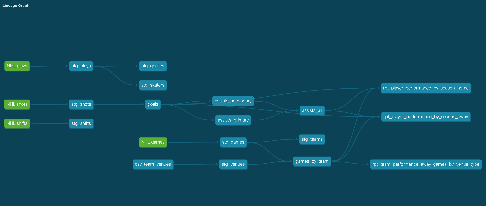
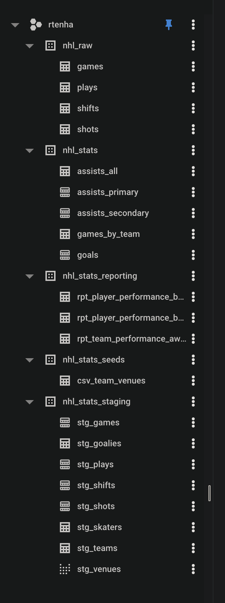

# NHL Stats _dbt demo

The purpose of this project is to demonstrate my understanding of _dbt, including advanced topics (see below).  To see the extracting and loading phases of this project, navigate up 1 level in the folder structure. Not ever staging model ended up being used, and the final models might be a bit silly, but this is just a demo!

## Data
NHL data was extracted from the NHL open data API.  I have only pulled a small sample, enough to write valid data models in dbt.

## dbt topics demonstrated
* configuration
    * `dbt_project.yml` - main configuration, including tags
    * `packages.yml` - include dbt's utils package
    * `profiles.yml` - included a copy (normaly in ~/.dbt), which shows database connection information.  Did not include separate dev/prod targets, as I am only contributor.
    * `schema.yml` - included in various folders to define sources, models, and add documentation
* project organization - this project is roughly organized into 3 sections:
    * `staging` - raw data is mostly JSON, so extracting, casting, renaming happens in these models
    * `marts` - models that build on the staged data to represent separate entities and concepts
    * `reporting` - denormalized models that might feed a BI tool (a few silly examples in this case).
* macros - Created a macro for use in the `reporting` layer to essentially run the same query twice by only changing a parameter.
* seed files - Included a seed file used for mapping/lookup teams to arenas/venues.
* tests - 3 default unique tests and 1 custom test concatenating two fields (1 player got traded between teams in the small window of data I pulled)
* consistent coding style
    * liberal use of CTEs
    * meaningful CTE names (no t1, t2, t3, etc !)
    * bring in `ref()`s at the top of the model - makes it easier to understand since it is at the top, not buried at the bottom of the file
    * case consistency - all lowercase (or upper if preferred) makes reading a particular model easier
    * comments - can never have too many!
    * simplified booleans (if possible) - `a > b as is_something` is preferred to `case when a > b then true else false end as is_something`
* documentation - descriptions entered in `schema.yml`

## Basic run steps
* `dbt deps` - make sure the `dbt_utils` package is loaded
* `dbt seed` - bring in the csv seed file
* `dbt run` - run all models
```
(venv) joeg@Joes-Mac-mini 03_transform_dbt % dbt run
Running with dbt=0.21.0
Found 16 models, 4 tests, 0 snapshots, 0 analyses, 372 macros, 0 operations, 1 seed file, 4 sources, 0 exposures

00:43:44 | Concurrency: 8 threads (target='prod')
00:43:44 | 
00:43:44 | 1 of 16 START table model nhl_stats_staging.stg_games................ [RUN]
00:43:44 | 2 of 16 START table model nhl_stats_staging.stg_plays................ [RUN]
00:43:44 | 3 of 16 START table model nhl_stats_staging.stg_shifts............... [RUN]
00:43:44 | 4 of 16 START table model nhl_stats_staging.stg_shots................ [RUN]
00:43:44 | 5 of 16 START view model nhl_stats_staging.stg_venues................ [RUN]
00:43:45 | 5 of 16 OK created view model nhl_stats_staging.stg_venues........... [OK in 1.05s]
00:43:47 | 3 of 16 OK created table model nhl_stats_staging.stg_shifts.......... [CREATE TABLE (9.3k rows, 2.5 MB processed) in 3.38s]
00:43:47 | 1 of 16 OK created table model nhl_stats_staging.stg_games........... [CREATE TABLE (66.0 rows, 13.5 KB processed) in 3.39s]
00:43:47 | 6 of 16 START table model nhl_stats.games_by_team.................... [RUN]
00:43:47 | 7 of 16 START table model nhl_stats_staging.stg_teams................ [RUN]
00:43:47 | 4 of 16 OK created table model nhl_stats_staging.stg_shots........... [CREATE TABLE (7.4k rows, 5.1 MB processed) in 3.66s]
00:43:47 | 8 of 16 START table model nhl_stats.goals............................ [RUN]
00:43:48 | 2 of 16 OK created table model nhl_stats_staging.stg_plays........... [CREATE TABLE (20.9k rows, 13.8 MB processed) in 3.98s]
00:43:48 | 9 of 16 START table model nhl_stats_staging.stg_goalies.............. [RUN]
00:43:48 | 10 of 16 START table model nhl_stats_staging.stg_skaters............. [RUN]
00:43:50 | 7 of 16 OK created table model nhl_stats_staging.stg_teams........... [CREATE TABLE (31.0 rows, 2.4 KB processed) in 2.79s]
00:43:50 | 6 of 16 OK created table model nhl_stats.games_by_team............... [CREATE TABLE (132.0 rows, 6.3 KB processed) in 3.10s]
00:43:50 | 11 of 16 START table model nhl_stats_reporting.rpt_team_performance_away_games_by_venue_type [RUN]
00:43:51 | 10 of 16 OK created table model nhl_stats_staging.stg_skaters........ [CREATE TABLE (656.0 rows, 460.9 KB processed) in 2.79s]
00:43:51 | 8 of 16 OK created table model nhl_stats.goals....................... [CREATE TABLE (420.0 rows, 808.0 KB processed) in 3.30s]
00:43:51 | 12 of 16 START table model nhl_stats.assists_primary................. [RUN]
00:43:51 | 13 of 16 START table model nhl_stats.assists_secondary............... [RUN]
00:43:51 | 9 of 16 OK created table model nhl_stats_staging.stg_goalies......... [CREATE TABLE (60.0 rows, 415.9 KB processed) in 3.09s]
00:43:53 | 11 of 16 OK created table model nhl_stats_reporting.rpt_team_performance_away_games_by_venue_type [CREATE TABLE (47.0 rows, 4.8 KB processed) in 2.69s]
00:43:54 | 13 of 16 OK created table model nhl_stats.assists_secondary.......... [CREATE TABLE (297.0 rows, 40.5 KB processed) in 2.99s]
00:43:54 | 12 of 16 OK created table model nhl_stats.assists_primary............ [CREATE TABLE (372.0 rows, 40.5 KB processed) in 3.00s]
00:43:54 | 14 of 16 START table model nhl_stats.assists_all..................... [RUN]
00:43:56 | 14 of 16 OK created table model nhl_stats.assists_all................ [CREATE TABLE (669.0 rows, 55.6 KB processed) in 2.39s]
00:43:56 | 15 of 16 START table model nhl_stats_reporting.rpt_player_performance_by_season_away [RUN]
00:43:56 | 16 of 16 START table model nhl_stats_reporting.rpt_player_performance_by_season_home [RUN]
00:43:59 | 16 of 16 OK created table model nhl_stats_reporting.rpt_player_performance_by_season_home [CREATE TABLE (446.0 rows, 36.5 KB processed) in 2.90s]
00:43:59 | 15 of 16 OK created table model nhl_stats_reporting.rpt_player_performance_by_season_away [CREATE TABLE (446.0 rows, 36.5 KB processed) in 3.31s]
00:43:59 | 
00:43:59 | Finished running 1 view model, 15 table models in 17.48s.

Completed successfully

Done. PASS=16 WARN=0 ERROR=0 SKIP=0 TOTAL=16
```
* `dbt test` - run all tests
```
(venv) joeg@Joes-Mac-mini 03_transform_dbt % dbt test
Running with dbt=0.21.0
Found 16 models, 4 tests, 0 snapshots, 0 analyses, 372 macros, 0 operations, 1 seed file, 4 sources, 0 exposures

00:44:25 | Concurrency: 8 threads (target='prod')
00:44:25 | 
00:44:25 | 1 of 4 START test dbt_utils_unique_combination_of_columns_stg_skaters_player_id__team_for [RUN]
00:44:25 | 2 of 4 START test unique_stg_games_game_id........................... [RUN]
00:44:25 | 3 of 4 START test unique_stg_goalies_player_id....................... [RUN]
00:44:27 | 3 of 4 PASS unique_stg_goalies_player_id............................. [PASS in 1.37s]
00:44:27 | 2 of 4 PASS unique_stg_games_game_id................................. [PASS in 1.41s]
00:44:27 | 4 of 4 START test unique_stg_teams_team.............................. [RUN]
00:44:28 | 4 of 4 PASS unique_stg_teams_team.................................... [PASS in 1.10s]
00:44:28 | 1 of 4 PASS dbt_utils_unique_combination_of_columns_stg_skaters_player_id__team_for [PASS in 2.69s]
00:44:28 | 
00:44:28 | Finished running 4 tests in 3.67s.

Completed successfully

Done. PASS=4 WARN=0 ERROR=0 SKIP=0 TOTAL=4
```

## DAG


## BigQuery representation of inputs and outputs



